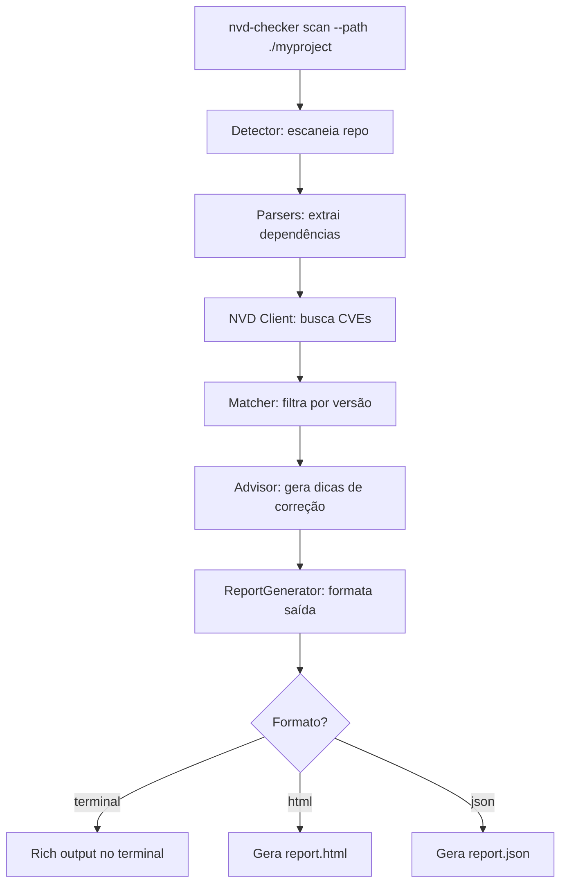

# NVD Checker — CLI para Verificação de Vulnerabilidades

Ferramenta CLI em Python que escaneia um repositório Git para identificar dependências de terceiros, consulta a NVD (National Vulnerability Database) API 2.0 para verificar vulnerabilidades conhecidas (CVEs) e gera relatórios detalhados com explicações e dicas de correção.

Inspirado no projeto de referência [pyndv](https://github.com/vit0r/pyndv), mas evoluído para usar a API 2.0 (a v1.1 feed foi descontinuada) e com funcionalidades de scan de dependências + geração de report.

## User Review Required

> [!IMPORTANT]
> **API Key NVD**: A API do NVD permite uso sem chave, mas com rate limit severo (5 req/30s). Com API key, o limite sobe para 50 req/30s. A ferramenta suportará ambos os modos, mas recomenda-se obter uma key em https://nvd.nist.gov/developers/request-an-api-key.

> [!IMPORTANT]
> **Linguagens suportadas inicialmente**: O scanner de dependências suportará Python (`requirements.txt`, `Pipfile`, `pyproject.toml`, `setup.cfg`), Node.js (`package.json`), Go (`go.mod`), Java (`pom.xml`) e Ruby (`Gemfile`). Deseja incluir outras?

## Open Questions

1. Deseja que o report em HTML tenha algum branding ou estilo específico, ou o padrão proposto (dark theme moderno) está ok?
2. Deseja integração com CI/CD (exit code != 0 quando há vulnerabilidades CRITICAL/HIGH)?
3. O mapeamento de nomes de pacotes para CPE Names na NVD nem sempre é 1:1. A ferramenta usará `keywordSearch` como fallback. Isso é aceitável?

## Proposed Changes

### Estrutura do Projeto

```
nvd-checker/
├── nvd_checker/
│   ├── __init__.py          # Package init + versão
│   ├── __main__.py          # Entry point CLI (Click)
│   ├── cli.py               # Comandos CLI (scan, report, check)
│   ├── scanner/
│   │   ├── __init__.py
│   │   ├── base.py          # Classe base para parsers de dependências
│   │   ├── python_parser.py # requirements.txt, Pipfile, pyproject.toml, setup.cfg
│   │   ├── node_parser.py   # package.json
│   │   ├── go_parser.py     # go.mod
│   │   ├── java_parser.py   # pom.xml
│   │   ├── ruby_parser.py   # Gemfile
│   │   └── detector.py      # Auto-detecta o tipo de projeto e dependências
│   ├── nvd/
│   │   ├── __init__.py
│   │   ├── client.py        # Cliente HTTP para NVD API 2.0
│   │   ├── models.py        # Dataclasses para CVE, CVSS, CPE
│   │   └── matcher.py       # Lógica de matching dependência → CVE
│   ├── report/
│   │   ├── __init__.py
│   │   ├── generator.py     # Gerador de relatórios (terminal, HTML, JSON)
│   │   ├── templates/       # Templates HTML para o report
│   │   │   └── report.html  # Template Jinja2 do relatório HTML
│   │   └── advisor.py       # Gera dicas de correção para cada CVE
│   └── utils.py             # Utilitários (logging, versão, helpers)
├── tests/
│   ├── __init__.py
│   ├── test_scanner.py
│   ├── test_nvd_client.py
│   ├── test_matcher.py
│   └── test_report.py
├── pyproject.toml            # Config do projeto (PEP 621)
├── README.md
├── LICENSE
└── .gitignore
```

---

### Componente: Scanner de Dependências (`nvd_checker/scanner/`)

#### [NEW] [base.py](file:///home/vitor.araujo/repos/nvd-checker/nvd_checker/scanner/base.py)
- Classe abstrata `DependencyParser` com interface `parse(filepath) -> list[Dependency]`
- Dataclass `Dependency(name, version, version_constraint, ecosystem, source_file)`

#### [NEW] [python_parser.py](file:///home/vitor.araujo/repos/nvd-checker/nvd_checker/scanner/python_parser.py)
- Parser para `requirements.txt` (regex para `pkg==version`, `pkg>=version`, etc.)
- Parser para `Pipfile` (TOML parsing da seção `[packages]`)
- Parser para `pyproject.toml` (seções `[project.dependencies]` e `[tool.poetry.dependencies]`)
- Parser para `setup.cfg` (seção `[options] install_requires`)

#### [NEW] [node_parser.py](file:///home/vitor.araujo/repos/nvd-checker/nvd_checker/scanner/node_parser.py)
- Parser para `package.json` (seções `dependencies` e `devDependencies`)

#### [NEW] [go_parser.py](file:///home/vitor.araujo/repos/nvd-checker/nvd_checker/scanner/go_parser.py)
- Parser para `go.mod` (linhas `require`)

#### [NEW] [java_parser.py](file:///home/vitor.araujo/repos/nvd-checker/nvd_checker/scanner/java_parser.py)
- Parser para `pom.xml` (elementos `<dependency>` via xml.etree)

#### [NEW] [ruby_parser.py](file:///home/vitor.araujo/repos/nvd-checker/nvd_checker/scanner/ruby_parser.py)
- Parser para `Gemfile` (regex para `gem 'name', 'version'`)

#### [NEW] [detector.py](file:///home/vitor.araujo/repos/nvd-checker/nvd_checker/scanner/detector.py)
- Escaneia o diretório do repositório Git procurando arquivos de dependência conhecidos
- Retorna lista consolidada de `Dependency` de todos os parsers aplicáveis

---

### Componente: Cliente NVD API 2.0 (`nvd_checker/nvd/`)

#### [NEW] [client.py](file:///home/vitor.araujo/repos/nvd-checker/nvd_checker/nvd/client.py)
- Classe `NVDClient` que consome `https://services.nvd.nist.gov/rest/json/cves/2.0`
- Suporte a API key via header `apiKey`
- Rate limiting automático (6s sem key, 0.6s com key)
- Paginação automática (`startIndex` + `resultsPerPage`)
- Métodos: `search_by_keyword(keyword, version)`, `search_by_cpe(cpe_name)`, `get_cve(cve_id)`
- Retry com backoff exponencial para erros 403/429/503

#### [NEW] [models.py](file:///home/vitor.araujo/repos/nvd-checker/nvd_checker/nvd/models.py)
- Dataclasses: `CVERecord`, `CVSSScore`, `CPEMatch`, `Weakness`, `Reference`
- Parsing do JSON da NVD API para objetos Python tipados
- Propriedade `severity_label` (CRITICAL, HIGH, MEDIUM, LOW, NONE)

#### [NEW] [matcher.py](file:///home/vitor.araujo/repos/nvd-checker/nvd_checker/nvd/matcher.py)
- Lógica de matching: `Dependency` → busca na NVD → `list[CVERecord]`
- Estratégia de busca em camadas:
  1. Tenta `keywordSearch` com nome do pacote + versão
  2. Filtra resultados por versão afetada (comparação semver)
- Cache de resultados para evitar queries duplicadas

---

### Componente: Gerador de Relatórios (`nvd_checker/report/`)

#### [NEW] [generator.py](file:///home/vitor.araujo/repos/nvd-checker/nvd_checker/report/generator.py)
- Classe `ReportGenerator` com métodos:
  - `to_terminal()` — Saída formatada com Rich (tabelas, cores por severidade, painéis)
  - `to_html(output_path)` — Relatório HTML completo com template Jinja2
  - `to_json(output_path)` — Exportação JSON estruturada
- Resumo executivo: total de deps, total com vulnerabilidades, breakdown por severidade

#### [NEW] [report.html](file:///home/vitor.araujo/repos/nvd-checker/nvd_checker/report/templates/report.html)
- Template HTML com dark theme moderno
- Seções: resumo, tabela de vulnerabilidades, detalhes por CVE, dicas de correção
- CSS inline para portabilidade (arquivo standalone)

#### [NEW] [advisor.py](file:///home/vitor.araujo/repos/nvd-checker/nvd_checker/report/advisor.py)
- Classe `SecurityAdvisor` que gera dicas de correção para cada CVE:
  - Sugestão de atualização de versão (quando disponível)
  - Links para patches/releases
  - Workarounds genéricos baseados no CWE type
  - Classificação de urgência baseada no CVSS score

---

### Componente: CLI (`nvd_checker/cli.py` + `__main__.py`)

#### [NEW] [cli.py](file:///home/vitor.araujo/repos/nvd-checker/nvd_checker/cli.py)
- Comando principal `nvd-checker` com subcomandos:
  - `scan` — Escaneia repositório e mostra vulnerabilidades no terminal
    - `--path` / `-p` — Caminho do repositório (default: `.`)
    - `--api-key` / `-k` — NVD API key (ou via env `NVD_API_KEY`)
    - `--severity` / `-s` — Filtrar por severidade mínima (LOW, MEDIUM, HIGH, CRITICAL)
    - `--format` / `-f` — Formato de saída (`terminal`, `html`, `json`)
    - `--output` / `-o` — Caminho do arquivo de saída (para html/json)
    - `--fail-on` — Falhar (exit code 1) se houver CVEs com severidade >= valor
  - `check` — Verifica uma dependência específica
    - `--name` — Nome da dependência
    - `--version` — Versão da dependência
  - `report` — Gera relatório completo a partir de um scan anterior (JSON)

#### [NEW] [__main__.py](file:///home/vitor.araujo/repos/nvd-checker/nvd_checker/__main__.py)
- Entry point: `python -m nvd_checker`

---

### Componente: Configuração do Projeto

#### [NEW] [pyproject.toml](file:///home/vitor.araujo/repos/nvd-checker/pyproject.toml)
- PEP 621 metadata
- Dependências: `click`, `requests`, `rich`, `jinja2`, `packaging`
- Entry point: `nvd-checker = nvd_checker.cli:cli`
- Python ≥ 3.10

#### [NEW] [README.md](file:///home/vitor.araujo/repos/nvd-checker/README.md)
- Documentação completa com instalação, uso, exemplos e screenshots

#### [NEW] [.gitignore](file:///home/vitor.araujo/repos/nvd-checker/.gitignore)
- Python standard gitignore

---

### Componente: Testes

#### [NEW] [test_scanner.py](file:///home/vitor.araujo/repos/nvd-checker/tests/test_scanner.py)
- Testes para cada parser de dependências com fixtures

#### [NEW] [test_nvd_client.py](file:///home/vitor.araujo/repos/nvd-checker/tests/test_nvd_client.py)
- Testes do cliente NVD com mocks (sem chamadas reais)

#### [NEW] [test_matcher.py](file:///home/vitor.araujo/repos/nvd-checker/tests/test_matcher.py)
- Testes da lógica de matching

#### [NEW] [test_report.py](file:///home/vitor.araujo/repos/nvd-checker/tests/test_report.py)
- Testes do gerador de relatórios

---

## Fluxo de Execução



## Verification Plan

### Automated Tests
```bash
# Instalar dependências de desenvolvimento
pip install -e ".[dev]"

# Rodar testes
pytest tests/ -v --tb=short

# Testar CLI manualmente
nvd-checker scan --path . --format terminal
nvd-checker check --name requests --version 2.25.0
```

### Manual Verification
- Executar `nvd-checker scan` contra o próprio repositório `nvd-checker`
- Verificar que o relatório HTML é gerado corretamente e abre no browser
- Verificar rate limiting funciona (sem API key)
- Testar com repositórios de diferentes linguagens
